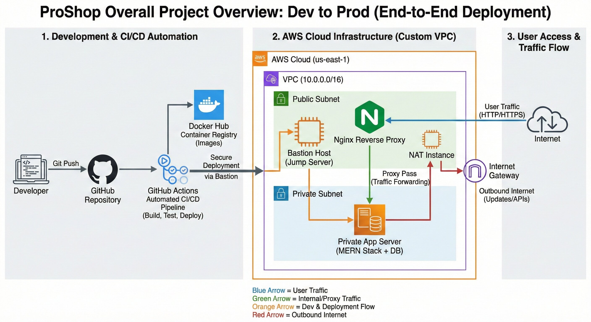
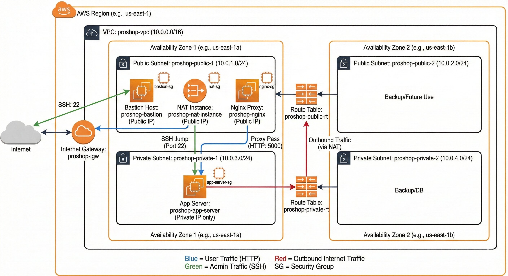
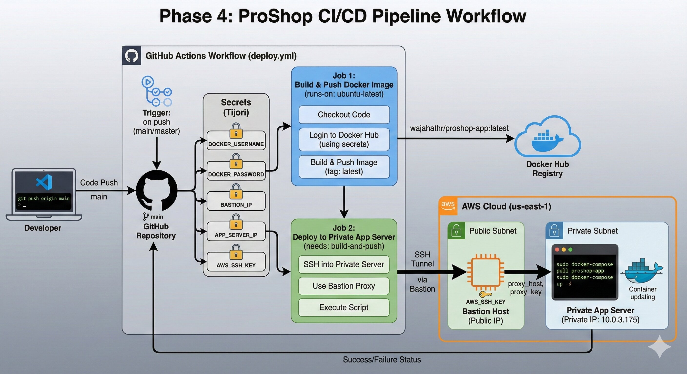

# 🛒 ProShop eCommerce - Enterprise-Grade AWS & DevOps Infrastructure

> A showcase of deploying a containerized MERN stack application using a "Hard Mode," security-first AWS architecture and fully automated CI/CD pipelines.

---

## 📖 The Storyline: Why This Project Exists?

### The Real-World Problem
In the modern web, deploying an e-commerce application directly to a public server is a recipe for disaster. If your application server and database are directly exposed to the internet, they become easy targets for hackers and data breaches. Standard "one-click" cloud deployments often mask these critical security risks.

### The "Hard Mode" Solution
This project moves beyond simple deployments. It addresses critical security concerns by building an **isolated, production-grade infrastructure from scratch on AWS.**

Instead of using expensive managed services, I chose the "Hard Mode" route: **manually configuring Linux networking, routing tables, and strict firewalls.** This approach demonstrates a deep, foundational understanding of how cloud networks actually work under the hood.

### 🚁 Overall Project Workflow
Here is the end-to-end flow of how code moves from a developer's machine to a highly secure production environment:

---

## 🏗️ Architectural Deep Dive (AWS Custom VPC)

The infrastructure is built on a custom AWS Virtual Private Cloud (VPC) designed for maximum security isolation.

### Core Components:
1. **The "Vault" (Private Subnet):** The Dockerized Node.js application and MongoDB database run on an EC2 instance that has **NO Public IP**. It is physically impossible for anyone on the internet to directly connect to it.
2. **🛡️ Bastion Host (Jump Server):** The *only* way for an administrator to SSH into the private server. It sits in the public subnet with strict security groups.
3. **🌐 Nginx Reverse Proxy:** The public face of the website. It listens on Port 80, receives user requests, and securely tunnels them internally to the hidden application server on Port 5000.
4. **🔄 Custom Linux NAT Router:** Instead of paying for an AWS NAT Gateway, I manually configured a Linux instance with `iptables` and IP forwarding to allow the Private Server to securely download updates from the internet.

---

## 🚀 Zero-Touch Automation (CI/CD Pipeline)

Deploying code to a hidden, private server is a complex challenge. I solved this using an advanced **GitHub Actions** workflow that acts as an automated 24/7 DevOps engineer.

### The 16-Second Deployment Flow:
1. **Code Push:** Code is pushed to the `main` branch.
2. **Build & Cache:** GitHub Actions builds a new, optimized Docker image (using `.dockerignore` and caching) and pushes it to Docker Hub using secured secrets.
3. **The Secure Jump:** The pipeline establishes a secure SSH connection to the **Bastion Host**, and uses it as a "ProxyJump" to tunnel directly into the **Private App Server**.
4. **Live Update:** Once inside the private network, it pulls the new image and performs a zero-downtime restart of the application containers using `docker compose`.

---

## 💻 Tech Stack & Tools

| Category | Technologies Used |
| :--- | :--- |
| **Cloud & Networking** | AWS VPC, EC2, Custom Route Tables, Security Groups, IGW |
| **OS & Security** | Ubuntu Linux, `iptables` (Manual NAT), SSH ProxyJump, Nginx |
| **Containerization** | Docker, Docker Compose, Docker Hub, Docker Volumes |
| **Automation** | GitHub Actions (CI/CD) |
| **Application** | MongoDB, Express.js, React.js, Node.js (MERN Stack) |

---

## 👨‍💻 About The Author

**Wajahat Rasool**
*Junior Cloud & DevOps Engineer ,Bahria University Karachi Campus*

This project was executed as part of the intensive training. It serves as a practical demonstration of moving beyond theoretical knowledge into building, troubleshooting, and automating resilient cloud infrastructures.

**Contact:** [wajahatrasool2003@gmail.com](mailto:wajahatrasool2003@gmail.com)